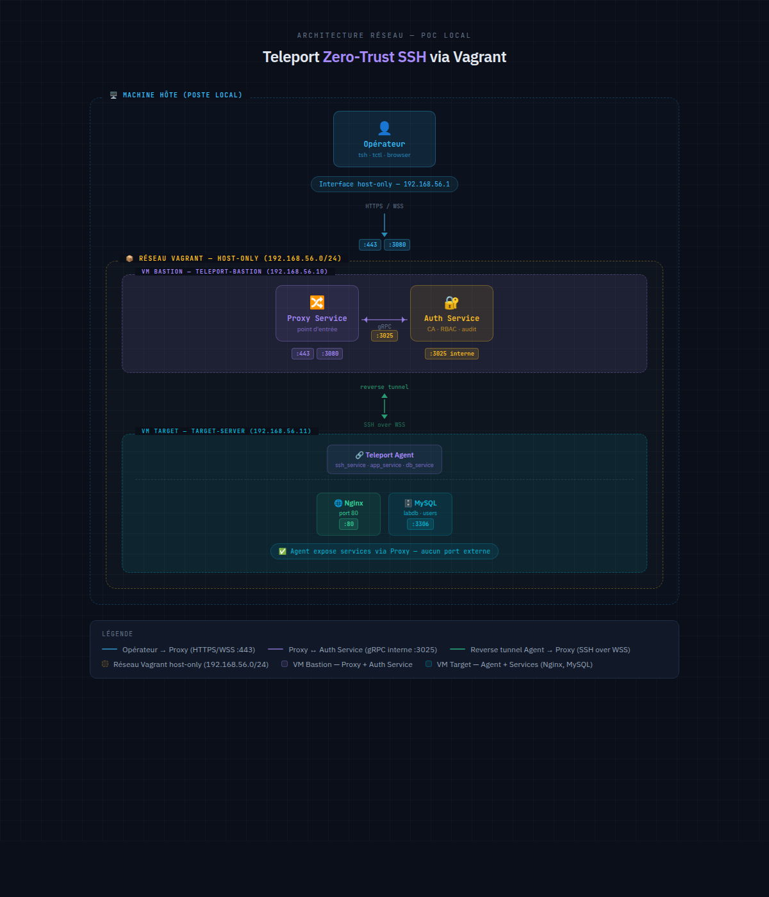

# demo-teleport

Infrastructure-as-code lab demonstrating **Teleport zero-trust access management** using Vagrant for VM orchestration and Ansible for service provisioning.

## Requirements

- **Vagrant** — VM orchestration
- **Ansible** — Configuration management
- **VirtualBox** — Hypervisor (default provider)
- **mise** (optional) — Tool version management (defined in `.mise.toml`)
- **direnv** (optional) — Environment variable loading (defined in `.envrc`)

## Architecture Diagram



**Key Points:**
- Operator connects to Proxy via HTTPS/WSS (:443, :3080)
- Proxy communicates with Auth Service via gRPC (:3025)
- Agent establishes reverse tunnel to Proxy (SSH over WSS)
- No external ports exposed on target server


## Installation

### 1. Clone and setup environment

```bash
git clone <repo-url>
cd demo-teleport
direnv allow      # Activate environment variables
```

### 2. Bootstrap VMs and services

```bash
task setup        # Full provisioning (Vagrant + Ansible)
```

This command:
- Creates two Ubuntu 24.04 VMs
- Generates Ansible inventory
- Provisions Bastion with Teleport Auth/Proxy
- Provisions Target with Teleport Agent, Nginx, MySQL

### 3. Verify deployment

```bash
task status                          # Check VM status
task logs:bastion                    # Stream bastion logs
task display-admin-invite:bastion    # Get admin login URL
```

### 4. Access the infrastructure

#### SSH Access (no Teleport needed)
```bash
vagrant ssh teleport-bastion
vagrant ssh target-server
```

#### Via Teleport
```bash
tsh login --proxy=192.168.56.10:3080 --insecure
tsh ssh root@target-server
```

#### Database Access (MySQL via Teleport)
```bash
# Login first
tsh login --proxy=192.168.56.10:3080 --insecure

# List available databases
tsh db ls

# Connect to MySQL database
tsh db login mysql-lab --db-user=alice
tsh db connect mysql-lab

# Execute queries via Teleport
# Example:
# mysql> SELECT * FROM labdb.messages;
```

**Available MySQL users:**
- `alice` (certificate-based auth)
- `teleport_admin` (certificate-based auth)

#### Application Access (Nginx via Teleport CLI)
```bash
# Login first
tsh login --proxy=192.168.56.10:3080 --insecure

# List available applications
tsh app ls

# Get app connection info
tsh app config nginx-app --insecure

# Login to the app and get certificates
tsh app login nginx-app --insecure

# Access via curl (with certificate-based authentication)
curl -s --insecure \
  --cert ~/.tsh/keys/192.168.56.10/teleport-admin-app/teleport-lab/nginx-app.crt \
  --key ~/.tsh/keys/192.168.56.10/teleport-admin-app/teleport-lab/nginx-app.key \
  --resolve nginx-app.192.168.56.10:3080:192.168.56.10 \
  https://nginx-app.192.168.56.10:3080/

# Or use the web UI to access the app
# Navigate to: https://192.168.56.10:3080
# Go to Apps tab → nginx-app → Connect (opens in browser)
```

### 5. Cleanup

```bash
task destroy      # Remove VMs and .vagrant directory
```

## References

- [Teleport Documentation](https://goteleport.com/docs/)
- [Vagrant Documentation](https://www.vagrantup.com/docs)
- [Ansible Documentation](https://docs.ansible.com/)

---

**Note**: This is a lab environment with self-signed certificates and pre-shared secrets. Not suitable for production.
